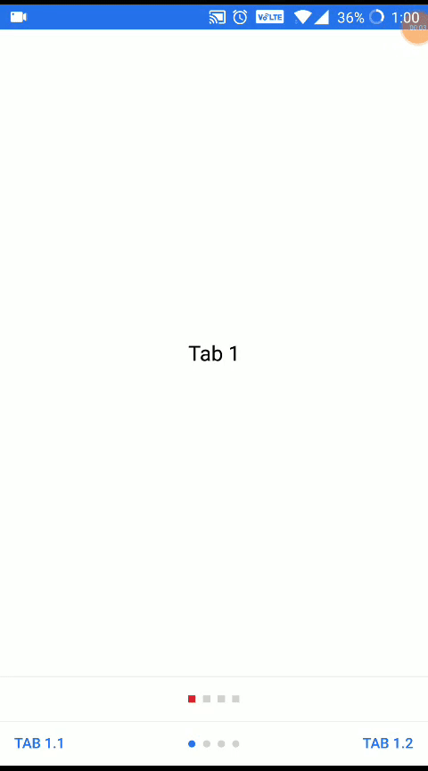

# react-native-tab-utils

## Build and run demo
- Run `npm install react-native-tab-utils`
- To run TabUtilsExample, add: 
  - Run `npm install rn-keyboard-aware-tab-view`. It's a modified react native community TabView which returns onPositionChange callback, used in TabUtilsExample.
  - In your index.js, add `import TabUtilsExample from "react-native-tab-utils/TabUtilsExample";` and `AppRegistry.registerComponent("AwesomeProject", () => TabUtilsExample);`.
  
## Usage
- Check sample code in TabUtilsExample.
- Use any TabView of your choice that provides a position-change / x-offset callback.
- Interpolate the x-offset into 0 to 1 for tab 1; 1 to 2 for tab 2, and so on.
- Pass the above value to your `TabIndicators` or `TabUtilsBar` ref as `this.tabUtilsBar.updateOffset(value);` or `this.tabIndicator.updateOffset(value);`.
